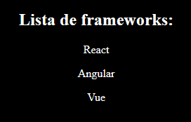

# Introdução ao React

## O que é?

O React é um framework do JavaScript, utilizado para a criação de páginas web. É um dos frameworks mais populares no mercado de JavaScript. Utiliza de uma metodologia moderna de criação de componentes para a manipulação do DOM. O React funciona em conjunto com o Node e utilizando os módulos do NPM, então para a sua utilização, precisamos ter estas ferramentas instaladas na máquina. Podemos verificar a instalação destas ferramentas na máquina através dos seguintes comandos executados no terminal:

### NodeJS


### NPM


### Download

Caso os comandos acima não tenham retornado a versão do seu NPM ou NodeJS, isso significa que você não os possui instalados na sua máquina. <a href="https://nodejs.org/en">Clique aqui</a> e você será encaminhado para o link de download do NodeJS que quando instalado, instala também a versão mais recente do NPM.

> Recomendo que baixe a versão LTS, recomendada para a maioria dos usuários.

## Utilização

Para criar uma ambiente de desenvolvimento em React, utilizamos do comando `npx create-react-app nome-do-projeto` como recomenda a própria documentação. Desta forma, será criada uma pasta do nosso projeto no nosso ambiente de desenvolvimento. Lembrando que é necessário para a execução deste comando ter instalado na máquina a versão mais recente do NPM.

### Exemplo:

```
npx create-react-app primeira-aplicacao
```

### Resultado:

Como resultado, obteremos a seguinte estrutura de arquivos no nosso ambiente.

<div align="center"></div>

Essa é a estrutura base para a criação da nossa aplicação com React.

> Em caso de erro ao utilizar o comando `npx create-react-app nome-do-projeto`, tente instalar globalmente a dependência “create-react-app” através do comando `npm install -g create-react-app` e tente novamente.

## Scripts

Dentre toda essa estrutura de arquivos criada a partir do comando utilizado acima, veremos que foi criado um arquivo *package.json*. Este arquivo contém várias configurações da nossa aplicação como alguns scripts que servirá para rodarmos nossa aplicação, podemos ver todos os scripts no objeto “scripts” do arquivo JSON. Vejamos:

<div align="center"></div>

Com isso, utilizaremos do script **“start”** para iniciar um servidor de desenvolvimento na web.

### Documentação:

https://create-react-app.dev/

<hr>

# App Function

Toda a nossa lógica de programação em React será escrita dentro do escopo da função App, utilizaremos do escopo global apenas para importação e exportação de recursos. Variáveis, funções e toda lógica pode ser criada dentro do escopo da função e ser utilizada para a interpolação no retorno JSX.

# JSX

O **JSX** é muito semelhante ao **HTML** e é uma forma de escrever código HTML dentro do JavaScript. Ele funciona de forma um pouco semelhante ao módulo EJS do Node, fazendo com que seja possível interpolar variáveis, lógicas e estruturas de JavaScript no código JSX. Para esta interpolação, basta utilizar do caractere de chaves `{}`.

### Exemplo de interpolação:

```JS
function App() {
    // Lógica
    const nome = 'Fernando';

    //JSX
    return (
        <div>
            <h1>JSX</h1>
            <p>Nome: {nome}</p>
        </div>
    );
}
```

> O retorno de JSX nos componentes não permite o retorno de vários elementos no mesmo nível, ou seja, é preciso que todo o conteúdo esteja englobado de uma tag, geralmente uma `<div>` a qual chamaremos de *wrapper* para que não seja apontado um erro.

## Classes no JSX

Para a definição de classes no JSX diferentemente do HTML convencional é necessária a utilização do atributo `className` pois no JavaScript a palavra `class` é uma palavra reservada da linguagem, tendo assim um conflito. A utilização do atributo `class` não ira quebrar a aplicação, porém, apontará um erro no console. Então por questão de boas práticas do React, é recomendado que seja utilizado o atributo `className`.

### Exemplo:

```JS
function App() {
    const nome = 'Fernando'

    return (
        <div className="App">
            <h1>JSX</h1>
            <p>Nome: {nome}</p>
        </div>
    );
}
```

<hr>

# Componentes

## O que são?

A utilização de componentes faz com que seja possível dividir e subdividir elementos do nosso código HTML para posterior utilização e reutilização. Um exemplo de componente é a função App, que temos visto até agora. Todos os componentes vão obedecer a essa mesma sintaxe:

### Sintaxe

```JS
// Escopo global reservado apenas para importações e exportações

function Component() {
    // Lógica...

    // Retorno do JSX
    return (
        //wrapper
        <div>
            <h1>Isso é um componente</h1>
        </div>
    );
}

export default Component;
```

### Importar

Podemos importar um componente dentro de outro através da sintaxe `<nomeDoComponent />`:

```JS
import './components/Component'; // Importando desta forma, o componente receberá o nome como foi o exportado

function OutroComponent() {
    return (
        <div>
            <Component />
            <h1>Este é outro componente</h1>
            <Component />
        </div>
    );
}

export default OutroComponent;
```

> Vejamos que podemos utilizar o mesmo componente várias vezes.

## Estrutura de arquivos

Por padrão é de costume que os componentes fiquem dentro de uma pasta chamada “components” dentro da pasta “src”. Em caso de necessidade, podemos até mesmo criar sub pastas dentro da pasta componentes para indicar um conjunto de componentes de um componente maior. Com essa estrutura, utilizaremos de um único “componente Pai” localizado fora da pasta de componentes que criamos, geralmente com o nome de “App”. Este arquivo será o arquivo “main” do nosso projeto. Geralmente este arquivo já é criado de maneira automática ao se utilizar do comando `npx create-react-app nome-do-projeto`.

### Estrutura:

<div align="center"></div>

<hr>

# Props

## O que é?

Props são valores passados para componentes no momento da importação desse componente. Através dos **props** podemos até mesmo passarmos valores dinâmicos.

## Sintaxe

Para utilizarmos das **props** basta na definição da função do componente definir o parâmetro pelo qual receberemos as props. Estas serão recebidas em formato de objeto do JavaScript, ou seja, para ter acesso aos valores das props, é necessário acessar suas propriedades.

### Exemplo:

```JavaScript
function Pessoa(props) {
    return (
        <div>
            <h1>Olá, {props.nome}!</h1>
            <p>Aqui segue alguns de seus dados:</p>
            <p>Idade: {props.idade}</p>
            <p>Profissão: {props.profissao}</p>
        </div>
    );
}

export default Pessoa;
```

No entanto, para simplificação desta sintaxe, podemos omitir a repetição do parâmetro `props` para referenciar o valor, utilizando de um **destructuring** na definição do parâmetro. Desta forma:

```JavaScript
function Pessoa({nome, idade, profissao}) {
    return (
        <div>
            <h1>Olá, {nome}!</h1>
            <p>Aqui segue alguns de seus dados:</p>
            <p>Idade: {idade}</p>
            <p>Profissão: {profissao}</p>
        </div>
    );
}

export default Pessoa;
```

## Passando valores

Para passar os valores das props na utilização dos componentes, basta passar estes com a mesma sintaxe de atributos no HTML, `chave="valor"`. Desta forma passaremos no JSX os valores das *props* que serão utilizadas no componente.

### Exemplo:

```JavaScript
import Pessoa from './components/Pessoa';

function App() {
    return (
        <div>
            <h1>Este é o componente main</h1>

            {/*Componente sendo passado props*/}
            <Pessoa nome="Fernando" idade="18" profissao="Programador" />
        </div>
    );
}

export default App;
```

Para deixar estes valores de forma **dinâmica**, é necessário que eles sejam definidos na lógica da função e interpolados na hora de passa-los como *props*.

### Exemplo:

```JavaScript
import Pessoa from './components/Pessoa';

function App() {
    // Lógica
    const nome = 'Fernando';
    const idade = 18;
    const profissao = 'Programador';
    
    return (
        <div>
            <h1>Este é o componente main</h1>

            {/*Componente passando props com interpolação*/}
            <Pessoa nome={nome} idade={idade} profissao={profissao} />
        </div>
    );
}

export default App;
```

<hr>

# Utilizando CSS com React

O **CSS** junto com o React, pode ser utilizado a nível global ou até mesmo a nível de componente. Isso serve para uma melhor organização, em projetos em que se é utilizado apenas um arquivo CSS global é normal que esse arquivo tenha facilmente mais de mil linhas de código, dificultando a manutenção do mesmo. Com a estilização a nível de componente, o CSS de toda aplicação fica divido, facilitando a manutenção no código.

## CSS global

Para utilizar de um CSS global, basta criar por convenção um arquivo `index.css` no mesmo nível do arquivo `index.js`. O arquivo `index.css` é um dos arquivos criados automaticamente quando utilizado o comando `create-react-app`, sendo assim, só é necessário que ele seja editado com as estilizações necessárias.

### Importação do CSS global

Após a estilização feita, caso não tenha sido editado o arquivo `index.js`, é possível notar nas primeiras linhas de código a importação do CSS. Desta forma:

```JavaScript
import './index.css';
```

Com isso, o CSS ja está funcionando globalmente na aplicação. Porém é importante enfatizar que **para a importação de CSS's a nível de componente, utilizaremos outra sintaxe**.

## CSS a nível de componente

Para a utilizar CSS dessa maneira, é de boa prática que a criação dos arquivos CSS seja no mesmo local dos arquivos de componente, ou seja, no diretório `./src/components/`. Além do mais é uma boa prática que para cada componente, o arquivo receba o nome do componente mais a extensão `module.css`, desta forma: `Componente.module.css`.

> Obs: No CSS é normal utilizar da forma de escrita *Kebab Case* (palavras separadas por traços) para a definição de classes e id's. No entanto, na utilização do CSS com o React é importante que não seja utilizado esta forma, pois no momento da importação, classes definidas usando essa sintaxe apontarão um erro no console. Podemos substituir a utilização desta pelas formas de escrita *Camel Case* (palavras separadas por letras maiúsculas com a primeira minuscula) ou *Snake Case* (palavras separadas por underlines).

### Importação do CSS do componente

Diferentemente da sintaxe utilizada para a importação de um CSS global como vimos, definiremos uma variável para o CSS no momento da importação, utilizando da sintaxe:

```JavaScript
import style from './Componente.module.css';
```
> Geralmente, por padrão, é utilizado o nome *"style"* ou *"styles"* para essa variável.

Após importa-lo, o JavaScript trabalhará com as classes e id's do CSS transformando-as em um objeto, de maneira semelhante ao que acontece com as *props*. Então, para utilizar do CSS no nosso componente, utilizaremos a seguinte sintaxe:

```JavaScript
import style from './Componente.module.css';

function Component() {
    // Utilização das classes definidas no CSS.
    return (
        <div className={style.container}>
            <h1 className={style.texto}>Este é um componente</h1>
        </div>
    );
}

export default Component;
```

> Vejamos que as classes definidas no CSS são interpretadas como sendo propriedades do objeto *style*, desta forma aplicamos as classes nos elementos através da interpolação da propriedade no atributo `className`.

<hr>

# React Fragments

## O que é?

Os *fragments* do React **é uma alternativa para a utilização de componentes**. Como ja sabemos, para a criação de um componente uma função deve retornar um JSX e esse retorno deve conter um *wrapper*, que é uma tag (geralmente uma `<div>`) englobando todos os elementos para que seja retornado um elemento só contendo toda a estrutura do componente. No entanto, a utilização de tantas tags `<div>` para cada componente pode fazer com que o código fique fora de contexto, ou até mesmo fora de semântica. Desta maneira, surge a necessidade dos fragmentos, estes fazem com que seja possível criar elementos no DOM sem que necessariamente esteja dentro de um `<div>`.

## Sintaxe

Para a utilização dos fragmentos, basta que no retorno JSX da função ao invés de utilizar uma tag `<div>` como *wrapper*, seja utilizado a tag `<>` e `</>`, abrindo e fechando (algo semelhante a uma "tag vazia"). Essa é uma tag exclusiva do JSX, ela indicará a evidência de um fragmento ao invés de um componente no DOM. Desta maneira:

### Exemplo:

``` JavaScript
function List() {
    // Retorno do JSX que indica um fragmento
    return (
        <>
            <ul>
                <li>Item 1</li>
                <li>Item 2</li>
                <li>Item 3</li>
            </ul>
        </>
    );
}

export default List;
```

> A importação de um fragmento é feita de maneira semelhante a de um componente. Ou seja, basta importa-lo no script usando a trecho de código `import Fragment from './components/Fragment'` e utiliza-lo no componente main através da sintaxe `<Fragment />`.

### Componente Main:

``` JavaScript
import Pessoa from './components/Pessoa';
import Frase from './components/Frase';
import List from './components/List';

function App() {
    // Lógica...
    const nome = 'Fernando';
    const idade = 18;
    const profissao = 'Programador';

    return (
        <div className="App">
            <h1>Este é o componente main</h1>
            <Pessoa nome={nome} idade={idade} profissao={profissao}/> {/*Component*/}
            <Frase /> {/*Component*/}
            <List /> {/*Fragment*/}
        </div>
    );
}

export default App;
```

### Resultado no DOM:


Nesta imagem é possível ver que os dois componentes presentes no código foram englobados por tags `<div>`, enquanto o fragmento (circulado em vermelho) foi impresso sem tag que os englobe.

<hr>

# Prop-Types

Podemos definir **tipos de valores para as props** dos componentes através da importação do pacote `prop-types`. Este é um módulo nativo do React, ou seja, não há a necessidade de se utilizar algum comando para instalação.

## Definição de tipos

Para definir tipos para as *props* é necessário que seja passado um objeto literal para a propriedade `propTypes` do componente criado. Os atributos deste objeto literal será a tipagem das *props*, sendo referenciada com chave semelhante ao nome da prop e o valor será o tipo da prop, sendo tipada a partir do módulo importado.

Uma funcionalidade interessante desse pacote é a marcação de uma *prop* como sendo obrigatória a passada de um valor para a mesma. Para isso, basta utilizar da propriedade `isRequired` do módulo.

### Exemplo:

``` JavaScript
import PropTypes from 'prop-types';

function Item({marca, ano_lancamento}) {
    return (
        <>
            <ul>
                <li>Marca: {marca}</li>
                <li>Ano de Lançamento: {ano_lancamento}</li>
            </ul>
        </>
    );
}

Item.propTypes = {
    marca: PropTypes.string.isRequired // Valor obrigatório e tipagem do tipo string
    ano_lancamento: PropTypes.number // Tipagem do tipo number (int, float)
}

export default Item;
```

>É importante enfatizar que a propriedade `propTypes` é diferente do módulo importado com o nome de `PropTypes`. A propriedade é onde será setado os tipos das *props*, no entanto o módulo é onde estão os tipos que passaremos para as *props*.

Quando passado valores que não condizem com os tipos definido para as *props* a aplicação não quebrará, porém será apontado um erro no console da aplicação. Isso facilita a futura manutenção do código por parte de outro desenvolvedores.

### Exemplo:


## Valor default para props

É possível fazer com que a *prop* receba um valor *default* quando não passado nenhum valor. Para isso, é necessário que seja passado um objeto literal para a propriedade `defaultProps` do componente, com a chave sendo semelhante ao nome da *prop* e o valor sendo o valor que esta terá por *default*. Desta forma:

### Exemplo:

``` JavaScript
function Item({marca, ano_lancamento}) {
    return (
        <>
            <ul>
                <li>Marca: {marca}</li>
                <li>Ano de Lançamento: {ano_lancamento}</li>
            </ul>
        </>
    );
}

Item.propTypes = {
    marca: PropTypes.string // Tipagem do tipo string
    ano_lancamento: PropTypes.number // Tipagem do tipo number (int, float)
}

// Valores default
Item.defaultProps = {
    marca: 'Sem registro de marca',
    ano_lancamento: 'Sem registro de ano de lançamento'
}

export default Item;
```

<hr>

# Eventos

## Como se utilizar de eventos no React
A sintaxe para a utilização de eventos no React é parecida com a sintaxe para a utilização de eventos no HTML. Basta que no JSX seja aplicado o evento na tag desejada, interpolando a função criada no contexto da lógica do componente com o código JSX.

### Exemplo:
``` JavaScript
// Criação do componente
function Evento() {
    // Função do evento
    function dispararEvento() {
        console.log('Evento disparado!');
    }

    return (
        <div>
            <p>Clique no botão para disparar o evento</p>
            {/*Interpolação do evento com a função*/}
            <button type="button" onClick={dispararEvento}>Ativar</button>
        </div>
    );
}

export default Evento;
```

> É possível observar que a criação da função do evento foi criada dentro do escopo da função do componente.

## Prevent Default

O evento `onSubmit` utilizado em formulários comumente será utilizado junto com o método `preventDefault` no React. Pois este método faz com que o fluxo de redirecionamento para outra pagina seja interrompido, fazendo com que a página não seja recarregada interrompendo a lógica definida no `onSubmit`. Este é um método da instância do evento, podemos utiliza-lo com a seguinte sintaxe.

### Exemplo

```JavaScript
function Componente() {
    
    function dispararEvento(e /*O parâmetro "e" indica o evento*/) {
        e.preventDefault(); // Método que previne o redirecionamento
        console.log('Evento foi disparado!');
    }

    return (
        <div>
            <form onSubmit={dispararEvento}>
                <input type="text" placeholder="Digite algo aqui"/>
                <button type="submit">Enviar</button>
            </form>
        </div>
    );
}

export default Componente;
```

> No exemplo acima a mensagem "Evento foi disparado!" exibido pelo console log da função `dispararEvento`, não seria exibida no console caso não houvesse a chamada do método `preventDefault`.

<hr>

# useState

## O que é?

O *useState* é um **hook**, resumidamente os hooks no React servem como auxiliares para ações que corriqueiramente precisamos desenvolver, otimizando assim o tempo de desenvolvimento. O *useState* especificamente, é um hook que facilita o manuseio do estado de um componente. Este hook funciona muito bem com eventos.

## Como utiliza-lo?

Para utiliza-lo, antes de tudo é necessário que o importemos do módulo *React*. Desta forma:

``` JS
import { useState } from "React";
```

Primeiramente, é necessário que seja definido constantes para os estados que iremos manusear, desta forma:

```JS
const [name, setName] = useState()
```

> Na constante `Name` ficará armazenado o valor atual do estado, ja na constante `setName` será armazenada uma função a qual será responsável pela atualização do valor da constante `Name`. Podemos também definir um valor inicial para a constante `Name`, basta que para isso, seja passado por argumento um valor na chamada da função `useState`.

Agora vejamos abaixo um exemplo de utilização desse hook na prática, em um componente de um formulário.

### Exemplo

```JS
// Importação do Hook
import { useState } from 'React';

// Componente
function Formulario() {
    
    // Função que irá ser chamada no evento 'onSubmit'
    function dispararEvento(e) {
        e.preventDefault();
        console.log(`O usuário ${name} foi cadastrado com a senha: ${password}`);
    }

    // Declaração das constantes para controle dos estados de nome e senha.
    const [name, setName] = useState();
    const [password, setPassword] = useState();

    // Retorno do JSX
    return (
        <form onSubmit={dispararEvento}>
            <div>
                <div>
                    <div>
                        {/*No JSX o atributo "for" é utilizado como "htmlFor" devido a palavra reservada*/}
                        <label htmlFor="nome">Nome: </label>
                        <input 
                        type="text" 
                        id="nome" 
                        name="nome" 
                        placeholder="Digite seu nome"
                        {/*Evento com a lógica que muda o estado da constante "name"*/}
                        onChange={(e) => setName(e.target.value)}
                        />
                    </div>
                    <div>
                        <label htmlFor="senha">Senha: </label>
                        <input 
                        type="text" 
                        id="senha" 
                        name="senha" 
                        placeholder="Digite sua senha" 
                        {/*Evento com a lógica que muda o estado da constante "password"*/}
                        onChange={(e) => setPassword(e.target.value)}
                        />
                    </div>
                </div>
            </div>
        </form>
    );
}

// Exportação do componente
export default Formulario;
```

Com o JavaScript padrão, a forma como seria implementado a lógica de captura de dado do DOM seria bem mais verbosa e utilizaria mais linhas de código. Utilizando do hook `useState` podemos implementar essa lógica dessa forma; sem a necessidade de utilizar de um `querySelector` para cada elemento manipulado.

<hr>

# Passando Eventos por props

Eventos também podem ser passados para elementos filhos por *props*, na verdade é uma boa prática que todos os eventos de uma funcionalidade fique concentrada no componente pai e que quando necessário, seja passada para os componentes filhos através das *props*. Para isso, basta que seja utilizada da sintaxe ja vista.

### Exemplo:

```JS
import ComponenteFilho from './components/ComponenteFilho';

function Componente() {
    function dispararEvento() {
        console.log('Evento disparado');
    }

    return (
        <div>
            <ComponenteFilho event={dispararEvento} />
        </div>
    );
}

export default Componente;
```

Com isso, basta utilizar no componente filho a *prop* passada. Desta forma:

```JS
function ComponenteFilho({event}) {
    return <button type="button" onClick={event}>Ativar</button>;
}

export default ComponenteFilho;
```

> Vejamos que quando o código JSX é formado por uma só linha de código com uma tag que obedeça a exigência de haver um *wrapper*, podemos retorna-la desta forma, sem a utilização dos parenteses, economizando linhas de código.

<hr>

# Renderização com condicional

É possível utilizar de estruturas condicionais nativas do React para renderizar dinamicamente partes do JSX. No entanto a sintaxe para fazer isso é um tanto quanto diferente do que estamos acostumados a ver em linguagens de programação. 

## Sintaxe

A sintaxe consiste:

```JS

// Componente
function Condicional() {
    // Variável que passará pela estrutura condicional
    const variavel = null;

    return (
        <div>

            {/*Condicional*/}
            {variavel && (
                <div>
                    <p>O valor da variável é {variavel}</p>
                </div>
            )}
        </div>
    );
}
```

A sintaxe da estrutura condicional em si, como é observado, consiste em:

```JS
{variavel && (/*estrutura JSX que será impressa caso a variável possua valor*/)}
```

Também é possível fazer outros tipos de verificações, basta utilizar da sintaxe:

```JS
{/*condição*/ ? (/*estrutura JSX que será impressa caso a condição seja verdadeira*/)}
```

Um exemplo da estrutura condicional acima na prática é:

```JS
{variavel >= 2 ? (<p>A variável é maior ou igual à dois</p>)}
```

> Observação: Os últimos códigos acima estão dentro do contexto de quando inserido no JSX.

### Exemplo

Um exemplo de utilização dessa estrutura na prática pode ser a seguinte:

``` JS
// Importação do hook "useState"
import { useState } from 'react';

// Componente
function Condicional() {
    // Constantes para controle de estados
    const [email, setEmail] = useState();
    const [userEmail, setUserEmail] = useState();

    // Funções dos eventos
    const enviarEmail = (e) => {
        e.preventDefault();
        setUserEmail(email);
    }

    const limparEmail = () => {
        setUserEmail('');
    }

    // Retorno do JSX
    return (
        <div>
            <h2>Cadastre o seu e-mail:</h2>
            <form>
                <input 
                type="email" 
                placeholder='Digite seu e-mail...' 
                required onChange={(e) => setEmail(e.target.value)}
                />
                <button type="submit" onClick={enviarEmail}>Enviar e-mail</button>

                {/*Estrutura condicional*/}
                {userEmail && (
                    <div>
                        <p>O e-mail do usuário é {userEmail}</p>

                        {/*Botão que limpa o valor da variável, saindo da condição*/}
                        <button type="button" onClick={limparEmail}>Limpar E-email</button>
                    </div>
                )}
            </form>
        </div>
    );
}

export default Condicional;
```

<hr>

# Renderização de listas

É possível fazer a renderização de listas (`array`) de forma dinâmica no componente. Para isso, basta que seja interpolado uma lógica com os métodos nativos do JavaScript para percorrer arrays.

### Exemplo:

```JS
function RenderizaçãoDeListas() {
    const lista = ['React', 'Vue', 'Angular'];

    return (
        <>
            <h2>Lista de frameworks:</h2>
            {
                lista.map(item => (<p>{item}</p>))
            }
        </>
    );
}
```

O código acima terá o seguinte resultado:

<div align="center">
    
</div>

No entanto, o seguinte erro será exibido no console:

<div align="center">
    
</div>

Isso acontece pois o React exige que seja passado uma *key* para cada elemento percorrido e exibido do array. Isso acontece para uma melhor localização e manutenção caso algum daqueles valores seja manipulado posteriormente. É de boa prática que o valor da *key* seja o mesmo do ID vindo do banco de dados, porém para fins de prática é possível utilizar para cada *key* o respectivo valor do índice em que se encontra no array.

Desta forma:

```JS
function RenderizaçãoDeListas() {
    const lista = ['React', 'Vue', 'Angular'];

    return (
        <>
            <h2>Lista de frameworks:</h2>
            {
                lista.map((item, index) => (<p key={index}>{item}</p>))
            }
        </>
    );
}
```

<hr>

# State Lift

O State Lift é um técnica utilizada para compartilhar o estado definido com *useState* com outros componentes. É normal que vários componentes dependam do mesmo *state* (estado), então é de boa prática que todos os *states* de uma funcionalidade estejam todos concentrados no componente pai. A utilização dessa técnica consiste em conceitos ja vistos, será definido os states no componente pai e passado aos outros através das props.

### Exemplo

No componente pai será definido os *states*, dessa forma:

```JS
import { useState } from 'React';
import ComponenteFilho1 from './components/ComponenteFilho1';

function ComponentePai() {
    // Definição dos estados
    const [name, setName] = useState();

    return (
        <div>
            {/*Passando por prop o método que manipula o state*/}
            <ComponenteFilho1 setName={setName} />
        </div>
    );
}

export default ComponentePai;
```

Neste caso, o state foi definido no componente pai e está sendo passado a função que manipula o state para o componente filho, onde será manipulado. Desta forma:

```JS
function ComponenteFilho1({setName}) {
    return (
        <>
            <input 
            type="text" 
            placeholder="Digite seu nome" 
            onChange={(e) => setName(e.target.value)}/>
        </>
    );
}

export default ComponenteFilho1;
```

Neste exemplo o estado que esta sendo definido no componente pai é alterado em um dos componentes filhos. No entanto os estados podem ser utilizados em vários componentes a partir do componente pai, ou seja, é possível até mesmo manipular um estado em um componente filho e em outro componente filho utiliza-lo. Imagine que agora este seja o código do componente pai:

```JS
import { useState } from 'React';
import ComponenteFilho1 from './components/ComponenteFilho1';
import ComponenteFilho2 from './components/ComponenteFilho2';

function ComponentePai() {
    // Definição dos estados
    const [name, setName] = useState();

    return (
        <div>
            {/*Passando por prop o método que manipula o state*/}
            <ComponenteFilho1 setName={setName} />

            {/*Passando por prop o state pro componente onde será utilizado*/}
            <ComponenteFilho2 name={name}>
        </div>
    );
}

export default ComponentePai;
```

A constante do estado do nome está sendo passado para o segundo componente filho onde o código é esse:

```JS
function ComponenteFilho2({name}) {
    return (
        <>
            {/*Condicional para imprimir mensagem apenas quando o state tiver valor*/}
            {name && (
                <p>Olá, {nome}, seja bem vindo!</p>
            )}
        </>
    );
}

export default ComponenteFilho2;
```

Desta forma o mesmo *state* definido no componente pai esta sendo utilizado por mais de um componente, nisso consiste a técnica de State Lift; uma boa prática que é constantemente usada no ambiente de desenvolvimento real.

<hr>

# Implementando o React Router

O React Router é um módulo a parte do React que permite que paginas estáticas sejam carregadas sem a necessidade de dar reload no navegador. Como este é um módulo a parte, requer que seja instalado com o comando:

```
npm install react-router-dom
```

Após isso, basta que este também seja importado no script onde será sua utilização, desta forma:

```JS
import {BrowserRouter as Router, Routes, Route, Link} from 'react-router-dom';
```

Deste módulo, iremos utilizar essas quatro ferramentas:

* **Link:** Componente que substituirá a tag `<a>` original do HTML.
* **Router:** Componente que servirá como *wrapper* do JSX.
* **Routes:** Componente que se utilizará em conjunto com o *Route* para a referência das paginas.
* **Route:** Componente que de fato irá referenciar o *link* através de suas props `path` e `element`, que serão passadas.

### Utilização

Para sua utilização na prática, o primeiro componente a se utilizar será o `Router`, utilizando-o como *wrapper* do retorno JSX. Todos os outros componentes importados do módulo `react-router-dom` se localizará dentro do `Router`. Desta forma:

```JS
import {BrowserRouter as Router, Routes, Route, Link} from 'react-router-dom'; 

function App() {
    return (
        <Router>
            {/*Lógica...*/}
        </Router>
    );
}

export default App;
```

Para exemplificação, utilizaremos de uma barra de navegação (um cenário muito comum em projetos reais) para se locomover de uma página para outra. No entanto, no momento de se utilizar as tags `<a>` utilizaremos o componente `<Link>` importado do módulo. Esse componente recebe uma *prop* chamada `to`, que será o equivalente ao `href` da tag `<a>` do HTML. Desta forma:

```JS
import {BrowserRouter as Router, Routes, Route, Link} from 'react-router-dom'; 

function App() {
    return (
        <Router>
            <nav>
                <ul>
                    <li>
                        <Link to="/">Home</Link>
                    </li>
                    <li>
                        <Link to="/empresa">Empresa</Link>
                    </li>
                    <li>
                        <Link to="/contato">Contato</Link>
                    </li>
                </ul>
            </nav>
        </Router>
    );
}

export default App;
```

No entanto, agora é necessário que as rotas a qual foram definidas na prop `to` sejam referenciadas a páginas existentes. Para isso, utilizaremos os componentes `<Routes>` e `<Route>`. Dentro do componente `<Routes>` ficará os componentes `<Route>` utilizado respectivamente de acordo com cada página definida com o componente `<Link>`. O componente `<Route>` receberá duas props: `path` onde será passado a mesma rota colocada no `<Link>`, e `element` onde será passado o diretório onde se encontra o arquivo da página equivalente aquela rota. Exemplo:

```JS
import {BrowserRouter as Router, Routes, Route, Link} from 'react-router-dom'; 

function App() {
    return (
        <Router>
            <nav>
                <ul>
                    <li>
                        <Link to="/">Home</Link>
                    </li>
                    <li>
                        <Link to="/empresa">Empresa</Link>
                    </li>
                    <li>
                        <Link to="/contato">Contato</Link>
                    </li>
                </ul>
            </nav>

            <Routes>
                <Route path="/" element="./pages/Home" />
                <Route path="/empresa" element="./pages/Empresa" />
                <Route path="/contato" element="./pages/Contato" /> 
            </Routes>
        </Router>
    );
}

export default App;
```

Com isso chegamos ao resultado esperado, ao usuário clicar em cada link a sua visualização da página será alterada sem que o navegador dê reload, melhorando assim a performance da aplicação.

### Documentação:

https://reactrouter.com/en/main

<hr>

# React Icons

O React Icons é um módulo externo do React que permite a utilização de ícones na aplicação. Ele integra os ícones das principais plataformas de ícones para Front End como Font Awesome, Devicons, Bootstrap icons e etc. Sua utilização se baseia em componentes, facilitando a maneira como é implementado esses ícones na aplicação.

## Importação

Este módulo requer que seja importado antes de utiliza-lo. Com o NPM instalado na maquina, basta utilizar do seguinte comando:


### Instalação:
```
npm install react-icons
```

### Importação:

A importação se baseia em um *destructuring* com os ícones a qual queremos utilizar na aplicação. Desta forma:

```JS
import {FaFacebook, FaInstagram} from 'react-icons/fa';
```

> A terminação `/fa` no final do nome do módulo que ta sendo importado significa a utilização dos ícones da plataforma Font Awesome, é possível utilizar dos ícones de outras plataformas mudando a terminação depois do caractere da barra. Para isso, recomendo consultar a documentação para ver todas as plataformas de ícones disponíveis para o *React Icons*.

## Utilização

A utilização dos ícones é bem didática. Os ícones são importados como forma de componente, então basta que seja utilizado o componente dentro do JSX e o ícone será exibido.

### Exemplo:

```JS
import {FaFacebook, FaInstagram, FaLinkedin} from 'react-icons/fa';

function Footer() {
    return (
        <footer>
            <ul>
                <li><FaFacebook /></li>
                <li><FaInstagram /></li>
                <li><FaLinkedin /></li>
            </ul>
        </footer>
    );
}

export default Footer;
```

Com isso, os ícones serão exibidos na tela. É possível ainda a customização do ícone, para isso, basta utilizar das técnicas que já vimos para que seja estilizado no CSS o svg do ícone.

### Documentação:

https://react-icons.github.io/react-icons/

<hr>

# Considerações Finais

Estas foram as minhas anotações no meu processo de aprendizagem das principais ferramentas do React. As anotações foram baseadas no <a href="https://www.youtube.com/playlist?list=PLnDvRpP8BneyVA0SZ2okm-QBojomniQVO">Curso de React</a> do <a href="https://www.youtube.com/@MatheusBattisti">Matheus Battisti</a> que se encontra gratuitamente no YouTube. As anotações é de minha autoria e baseadas na minha interpretação e entendimento do conteúdo apresentado no curso, com o intuito de revisar quando necessário e ajudar desenvolvedores que também estejam aprendendo sobre a tecnologia. Peço encarecidamente o auxílio do leitor caso haja algum erro de digitação ou explicação de algum conceito; em caso de qualquer anomalia na anotação, peço que seja feito um pull request corrigindo a respectiva parte. 

Espero ter ajudado sintetizando algumas das principais ideias do React. Muito obrigado pela leitura do artigo. Se possível, por favor, dê uma estrelinha no repositório e siga meu perfil no github.✨

## Até a proxima meu amigo dev!